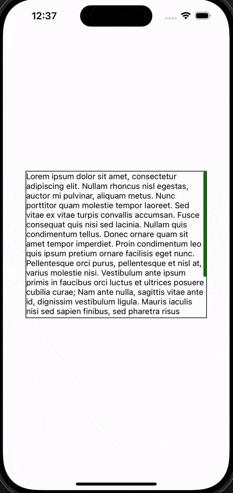
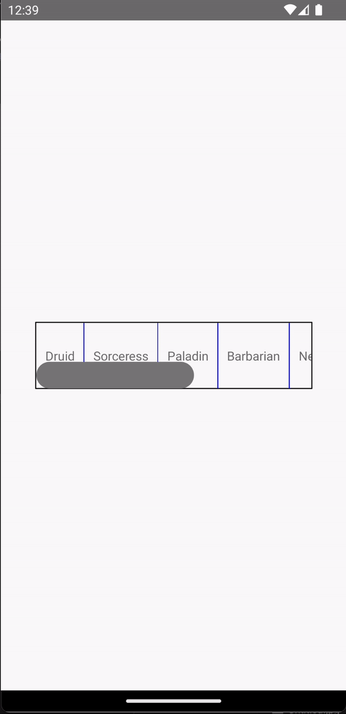
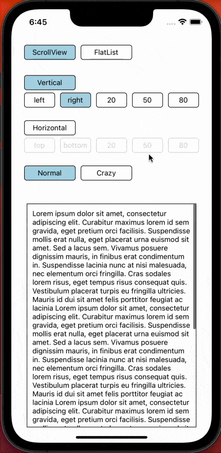

# @fanchenbao/react-native-scroll-indicator

A react-native component that offers a customizable scroll indicator for ScrollView and FlatList

## Disclaimer

The central idea of animating a custom scroll indicator is borrowed from [Lord Pooria's SO answer](https://stackoverflow.com/a/57839837/9723036).

## Why do we need another customizable scroll indicator?

If you search for react native scroll indicator on npm, there are more than 10 packages already there. Compared to those, this package has the following advantages:

* Supports:
  - Both `ScrollView` and `FlatList`
  - Both vertical and horizontal scrolling
  - Indicator shrinking in iOS when user scrolls beyond the edge
  - `inverted={true}` in `FlatList`
  - Indicator customization just like a regular `View` (e.g. color, width, position, etc.)
* Detailed documentation with comprehensive examples
* The animation logic of the indicator is well documented in the source code. You can fork the repo and maintain it yourself. Hint: it does NOT use `PanResponder`.

## Installation

```sh
npm install @fanchenbao/react-native-scroll-indicator
```

## Usage

### ScrollViewIndicator

```js
import * as React from 'react';
import {View, Text} from 'react-native';
import {ScrollViewIndicator} from '@fanchenbao/react-native-scroll-indicator';

const App = () => {
  return (
    <View
      style={{
        flex: 1,
        justifyContent: 'center',
        alignItems: 'center',
      }}>
      <View
        style={{
          height: '30%',
          width: '80%',
          borderWidth: 1,
          borderColor: 'black',
        }}>
        <ScrollViewIndicator indStyle={{backgroundColor: 'green'}}>
          <View>
            <Text>
              Lorem ipsum dolor sit amet, consectetur adipiscing elit. Nullam
              rhoncus nisl egestas, auctor mi pulvinar, aliquam metus. Nunc
              porttitor quam molestie tempor laoreet. Sed vitae ex vitae turpis
              convallis accumsan. Fusce consequat quis nisi sed lacinia. Nullam
              quis condimentum tellus. Donec ornare quam sit amet tempor
              imperdiet. Proin condimentum leo quis ipsum pretium ornare
              facilisis eget nunc. Pellentesque orci purus, pellentesque et nisl
              at, varius molestie nisi. Vestibulum ante ipsum primis in faucibus
              orci luctus et ultrices posuere cubilia curae; Nam ante nulla,
              sagittis vitae ante id, dignissim vestibulum ligula. Mauris
              iaculis nisi sed sapien finibus, sed pharetra risus rutrum. Cras
              laoreet mattis egestas. Pellentesque feugiat accumsan ultricies.
              Nullam viverra sapien nec tellus commodo aliquet. Integer faucibus
              quam sed nibh congue, at cursus risus vulputate. Morbi commodo
              mollis tempus.
            </Text>
          </View>
        </ScrollViewIndicator>
      </View>
    </View>
  );
};

export default App;
```



### FlatListIndicator

```js
import * as React from 'react';
import {View, Text} from 'react-native';
import {FlatListIndicator} from '@fanchenbao/react-native-scroll-indicator';

const App = () => {
  return (
    <View
      style={{
        flex: 1,
        justifyContent: 'center',
        alignItems: 'center',
      }}>
      <View
        style={{
          height: '10%',
          width: '80%',
          borderWidth: 1,
          borderColor: 'black',
        }}>
        <FlatListIndicator
          flatListProps={{
            ItemSeparatorComponent: () => (
              <View style={{width: 1, backgroundColor: 'blue'}} />
            ),
            data: [
              'Druid',
              'Sorceress',
              'Paladin',
              'Barbarian',
              'Necromancer',
              'Assassin',
              'Amazon',
            ],
            renderItem: ({item}) => (
              <View style={{justifyContent: 'center', padding: 10}}>
                <Text>{item}</Text>
              </View>
            ),
          }}
          horizontal={true}
          position="bottom"
          indStyle={{width: 30}}
        />
      </View>
    </View>
  );
};

export default App;
```



## Comprehensive Examples

[**Try it on Snack Expo**](https://snack.expo.dev/@fanchenbao/react-native-scroll-indicator_demo)

The comprehensive example takes advantage of the scroll indicator's customizability. A brief summary of the corresponding props for each option is given below. For details, refer to the Props table.

* Horizontal: `horizontal={true}`
* Vertical: `horizontal={false}` 
* left: `position="left"`
* right: `position="right"`
* top: `position="top"`
* bottom: `position="bottom"`
* 20: `position={20}`
* 50: `position={50}`
* 80: `position={80}`
* Normal: `indStyle={backgroundColor: 'grey', width: 5, borderRadius: 3}`
* Crazy: `indStyle={backgroundColor: 'red', width: 60, borderRadius: 50}`





## Run Comprehensive Examples

Download this repo

```sh
git clone https://github.com/FanchenBao/react-native-scroll-indicator.git
```

Go to the `example` folder and sets up the example app

```sh
npm install
```

While inside the `example` folder, run the app for iOS

```sh
npm run ios
```

or Android

```sh
npm run android
```

The example app is running from [`./example/App.tsx`](./example/App.tsx)

## Props

| Props               | Type                                 | Defult                                                 | Note                                                                                                                                                                                                                                                                                                                                                                                                                                                                                                                                                                                                                                                                                                                                                                                                                       |
|---------------------|--------------------------------------|--------------------------------------------------------|----------------------------------------------------------------------------------------------------------------------------------------------------------------------------------------------------------------------------------------------------------------------------------------------------------------------------------------------------------------------------------------------------------------------------------------------------------------------------------------------------------------------------------------------------------------------------------------------------------------------------------------------------------------------------------------------------------------------------------------------------------------------------------------------------------------------------|
| horizontal          | boolean                              | `false`                                                | If false, vertical scrolling. If true, horizontal scrolling.                                                                                                                                                                                                                                                                                                                                                                                                                                                                                                                                                                                                                                                                                                                                                               |
| position            | string \| number                     | `''`                                                   | Desired position of the indicator. One can supply "left" or "right" for vertical scrolling, in which case the indicator will be placed at the left or right edge of the view. The same goes for "top" or "bottom" for horizontal scrolling. In addition, one can supply a number, which indicates where in the view the indicator's center line (along the scrolling direction) will be located. For example, `position={20} horizontal={false}` would place the center line of the indicator at 20% of the view's width from its left edge. `position={80} horizontal={true}` would place the center line of the indicator at 80% of the view's height from its top edge. If the indicator's girth is too big such that if its center line is placed at the desired location, the indicator would overflow outside the edge, the position will be automatically clamped to ensure no overflow takes place. This is demonstrated in the comprehensive example when the "Crazy" option is selected. If supplied an empty string, the position is automatically assigned to `"right"` if vertical scrolling, or `"bottom"` if horizontal scrolling. |
| persistentScrollbar | boolean                              | `false`                                                | If false, scroll indicator does not show if the content can fit the view. If true, scroll indicator shows under all circumstances.                                                                                                                                                                                                                                                                                                                                                                                                                                                                                                                                                                                                                                                                                         |
| indStyle            | ViewStyle                            | `{backgroundColor: 'grey', width: 5, borderRadius: 3}` | Styling of the scroll indicator. The scroll indicator is just an `Animated.View`. Thus, any props that modifies a `View` can potentially modify the appearance of the scroll indicator. Note that `width` refers to the girth of the indicator, which is width in vertical scrolling but height in horizontal scrolling. Please do not assign the following props, as they will be overwritten and won't have any effect: `position`, `height`, `transform`.                                                                                                                                                                                                                                                                                                                                                                                         |
| scrollViewProps     | ScrollViewProps                      | `{}`                                                   | `ScrollViewIndicator` only. Props to pass to the underlying `ScrollView`. Please do not pass the following props, as they will be overwritten and won't have any effect: `horizontal`, `showsVerticalScrollIndicator`, `showsHorizontalScrollIndicator`, `onContentSizeChange`, `onLayout`, `scrollEventThrottle`, `onScroll`                                                                                                                                                                                                                                                                                                                                                                                                                                                                                                                                                                                                                                                                                                                                                 |
| flatListProps       | ScrollViewProps & FlatListProps<any> | **required**                                           | `FlatListIndicator` only. Props to pass to the underlying `FlatList`. This is a required prop, as one must supply `data` and `renderItem` to `FlatList`. Please do not pass the following props, as they will be overwritten and won't have any effect: `horizontal`, `showsVerticalScrollIndicator`, `showsHorizontalScrollIndicator`, `onContentSizeChange`, `onLayout`, `scrollEventThrottle`, `onScroll`                                                                                                                                                                                                                                                                                                                                                                                                                                                                                                                                                                                                                                                                    |


## Limitations

The package is designed to be a substitute of `ScrollView` and `FlatList` under the most basic usage. Thus, despite allowing any props from `ScrollView` and `FlatList` to be passed to `ScrollViewIndicator` and `FlatListIndicator`, the package has NOT been fully tested on the combination of all the props. It is very likely that some prop combinations would break the custom scroll indicator. If that happens, please raise an issue or suggest a feature request on GitHub.

## Contributing

See the [contributing guide](CONTRIBUTING.md) to learn how to contribute to the repository and the development workflow.

## License

MIT

---

Made with [create-react-native-library](https://github.com/callstack/react-native-builder-bob)
